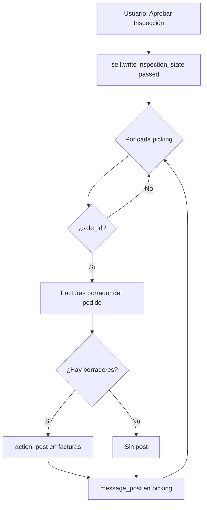
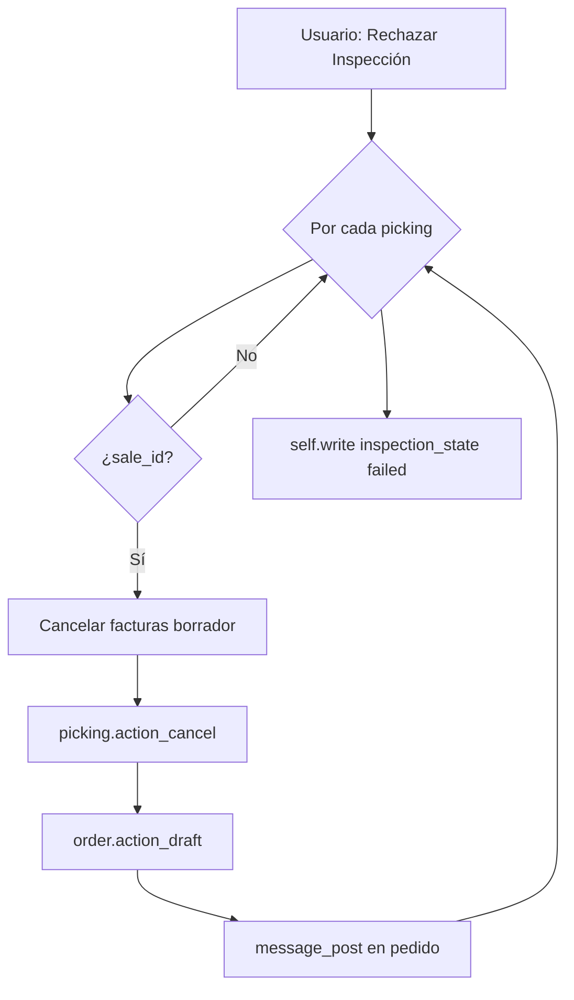

# Manual técnico — Logistics Inspection Workflow

## Introducción

| Atributo | Valor |
|----------|--------|
| **Nombre técnico del módulo** | `logistics_inspection` |
| **Nombre en interfaz** | Logistics Inspection Workflow |
| **Versión declarada** | 19.0.1.0.0 (según `__manifest__.py`) |
| **Licencia** | LGPL-3 |
| **Objetivo** | Añadir a los albaranes de stock un estado de inspección (flujo tipo rayos X) y dos acciones: aprobar (publicar facturas borrador del pedido vinculado) o rechazar (cancelar borradores, cancelar albarán, devolver pedido a borrador y notificar). |

**Compatibilidad:** el manifiesto fija la serie **19.0**. Para despliegues en 12.0–18.0 habría que ajustar el manifiesto y validar APIs (`invoice_ids`, `action_draft`, `button_cancel`, etc.), que pueden variar entre versiones.

**Dependencias declaradas:** `sale_management`, `stock`, `account`.

---

## Arquitectura de datos

### Modelos

| Modelo | Tipo | Descripción |
|--------|------|-------------|
| `stock.picking` | `_inherit` | Extiende el albarán estándar; no introduce un modelo nuevo en base de datos más allá de columnas nuevas en la misma tabla `stock_picking`. |

### Campos añadidos en `stock.picking`

| Campo | Tipo Odoo | Etiqueta / uso | Ayuda implícita |
|-------|-----------|----------------|-----------------|
| `inspection_state` | `Selection` | Estado Inspección | Valores: `draft` (Pendiente), `passed` (Aprobado), `failed` (Rechazado). Por defecto `draft`. `tracking=True` integra cambios en el chatter del albarán (se apoya en `mail.thread` si el modelo base lo incluye en esa versión). |

### Relaciones relevantes (existentes en el núcleo, usadas por la lógica)

| Relación | Tipo | Modelo destino | Uso en este módulo |
|----------|------|----------------|-------------------|
| `sale_id` | Many2one (estándar en entregas vinculadas a venta) | `sale.order` | Condiciona facturación y reversión del flujo. |
| `sale_id.invoice_ids` | One2many / inverse | `account.move` | Filtrado por `state == 'draft'` para publicar o cancelar. |

No se definen campos computados ni restricciones SQL/XML adicionales en el código analizado.

---

## Flujo de lógica (Mermaid)

### Aprobación de inspección (`action_inspection_pass`)

### Rechazo de inspección (`action_inspection_fail`)

### Visibilidad de botones (vista)

Los botones se muestran solo con `inspection_state == 'draft'` y albarán no cancelado (`state != 'cancel'`), según la vista heredada.

---

## Explicación de funciones y herencia

### Clase `StockPicking`

- **Rol:** extensión concreta de `stock.picking` mediante `_inherit` (no es `models.AbstractModel`); los métodos y campos se fusionan con el modelo estándar de inventario.
- **Sin mixins nuevos:** el módulo no añade `mail.thread` por sí mismo; si el formulario muestra seguimiento en el campo, depende de la definición base de `stock.picking` en la versión instalada.

### `action_inspection_pass`

- **Qué hace:** pone primero todo el recordset en estado de inspección aprobado; luego, por cada línea con pedido de venta, publica facturas en borrador y deja un mensaje en el chatter del albarán.
- **Por qué importa el orden del `write`:** el estado pasa a `passed` antes del bucle, de modo que la operación es global al conjunto y no depende de que cada iteración escriba el estado.

### `action_inspection_fail`

- **Qué hace:** para líneas con `sale_id`, cancela borradores contables, cancela el albarán, devuelve el pedido a borrador y notifica; al final marca **todo** `self` como `failed`.
- **Punto de atención documentado (sin corrección en código):** si algún picking del recordset carece de `sale_id`, no se ejecutan cancelaciones ni `action_draft` para ese registro, pero el `write` final igualmente marca `failed`. Relevante en acciones masivas o datos inconsistentes.

### Riesgos de versión (solo documentación)

- **`sale.order.action_draft`:** nombre y reglas de negocio (líneas bloqueadas, picking ya hecho, etc.) pueden diferir entre versiones o personalizaciones.
- **Facturación:** el conjunto `invoice_ids` y estados (`draft`, etc.) deben alinearse con el flujo contable deseado (facturas de cliente vs proveedor, documentos rectificativos, etc.).

---

## Archivos de datos y carga

| Archivo | Función |
|---------|---------|
| `views/stock_picking_views.xml` | Hereda `stock.view_picking_form`: botones de objeto y barra de estado `inspection_state`. |

No se incluye carpeta `security/` en el módulo: los permisos efectivos dependen de los grupos del usuario sobre `stock.picking`, `sale.order` y `account.move` definidos por los módulos estándar y por la empresa.

---

## Convención de documentación en código

Los docstrings del código Python siguen estilo **Google / Sphinx** (`:param:`, `:type:`, `:return:`) en español, alineado con buenas prácticas de legibilidad tipo OCA, sin alterar la lógica ejecutable.
